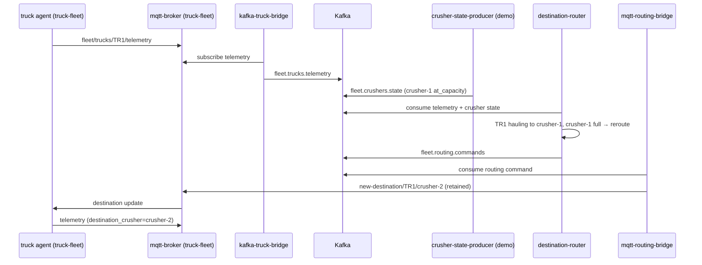

# Fleet integration (`fleet-integration`)

Kafka-based orchestration layer that connects the three independent mining-fleet ecosystems without modifying their internals. Routing intelligence lives here — not in `truck-fleet`, `crusher-fleet`, or `water-spray-fleet`.

Parent overview: [../README.md](../README.md).

---

## Independence principle

| System | Namespace | What it owns | What it does **not** do |
|--------|-----------|--------------|-------------------------|
| **Truck fleet** | `truck-fleet` | MQTT telemetry, PostgreSQL ingest | Crusher logic, routing decisions |
| **Crusher fleet** | `crusher-fleet` | Modbus PLCs, plant historian | MQTT, truck commands |
| **Water spray fleet** | `water-spray-fleet` | Modbus spray PLCs | Truck/crusher internals |
| **Fleet integration** | `fleet-integration` | Kafka orchestration, MQTT routing bridge | Own operational data stores |

Trucks bootstrap from **`DEFAULT_CRUSHER`** (env per Pod). Runtime rerouting arrives **only** via MQTT `new-destination/{truck_id}/{crusher_name}`, published by **`mqtt-routing-bridge`** in this namespace.

Crushers do **not** talk MQTT. Crusher state enters Kafka from `crusher-fleet` (Phase 2) or the Phase 1 demo producer here.

---

## Architecture

```text
truck-fleet (unchanged)          crusher-fleet (unchanged)        water-spray-fleet (unchanged)
  MQTT telemetry                    Modbus/API → own store           Modbus → own store
  mqtt-ingest → PostgreSQL          → Kafka (future)                 → Kafka (future)
       ↓ CDC/ETL                          ↓
       └──────────────→  fleet-integration / Kafka (AMQ Streams)  ←────────┘
                              ↓
                    destination-router
                    consumes: fleet.trucks.telemetry, fleet.crushers.state
                    produces: fleet.routing.commands
                              ↓
                    mqtt-routing-bridge
                    consumes fleet.routing.commands → MQTT new-destination/{truck}/{crusher}
```

Phase 1 demo adds **`kafka-truck-bridge`** (MQTT subscribe → Kafka produce) and **`crusher-state-producer`** (mock crusher capacity) because full CDC and crusher-fleet are not deployed yet.

---

## Sequence diagram (destination reroute)



---

## Kafka topic contracts

### `fleet.trucks.telemetry`

Produced by: `kafka-truck-bridge` (Phase 1 demo) or Debezium CDC / ETL from truck PostgreSQL (Phase 2).

Partition key: `truck_id`

```json
{
  "truck_id": "TR1",
  "state": "hauling",
  "destination_crusher": "crusher-1",
  "load_pct": 100.0,
  "position_x": -800.0,
  "position_y": 400.0,
  "speed_kmh": 35.0,
  "timestamp": "2026-06-01T12:00:00+00:00",
  "source": "mqtt-bridge"
}
```

### `fleet.crushers.state`

Produced by: `crusher-state-producer` (Phase 1 demo) or `crusher-fleet` plant-collector (Phase 2).

Partition key: `crusher_name`

```json
{
  "crusher_name": "crusher-1",
  "status": "full",
  "fill_pct": 95.0,
  "at_capacity": true,
  "max_queue": 3,
  "current_queue": 4,
  "updated_at": "2026-06-01T12:00:00+00:00",
  "source": "demo-crusher-state-producer"
}
```

### `fleet.routing.commands`

Produced by: `destination-router`. Consumed by: `mqtt-routing-bridge`.

Partition key: `truck_id`

```json
{
  "truck_id": "TR1",
  "crusher_name": "crusher-2",
  "reason": "crusher-1_at_capacity",
  "decided_at": "2026-06-01T12:00:05+00:00",
  "source": "destination-router"
}
```

MQTT bridge publishes to **`new-destination/{truck_id}/{crusher_name}`** with retained QoS 1 (same contract trucks already use).

---

## Routing rule (Phase 1)

When a truck is in **`hauling`** or **`loading`** state and its `destination_crusher` is **at capacity** (from `fleet.crushers.state`), `destination-router` emits a command to the first available alternate crusher (`crusher-2` by default).

Edit demo crusher state:

```bash
oc edit configmap demo-crusher-state -n fleet-integration
# Set crusher-1 at_capacity: true to trigger reroutes
```

---

## Repository layout

| Path | Contents |
|------|----------|
| [`poc/fleet-integration/`](../../poc/fleet-integration/) | Python services + Dockerfiles |
| [`openshift/fleet-integration/`](../../openshift/fleet-integration/) | Namespace, ConfigMaps, BuildConfigs, Deployments, Kafka topics |

### Components

| Service | Role |
|---------|------|
| **`kafka-truck-bridge`** | Subscribes `fleet/trucks/+/telemetry` on truck-fleet MQTT → produces `fleet.trucks.telemetry` |
| **`crusher-state-producer`** | Demo mock → produces `fleet.crushers.state` from ConfigMap |
| **`destination-router`** | Consumes telemetry + crusher state → produces `fleet.routing.commands` |
| **`mqtt-routing-bridge`** | Consumes routing commands → publishes `new-destination/{truck}/{crusher}` to truck-fleet MQTT |

---

## Prerequisites

1. **`truck-fleet`** running (MQTT broker, truck agents, mqtt-ingest).
2. **Kafka / AMQ Streams** — Strimzi cluster `my-cluster` in namespace `kafka-demo` (or adjust `KAFKA_BOOTSTRAP_SERVERS` in ConfigMap).

### Install Kafka topics (when cluster has Strimzi)

```bash
oc apply -n kafka-demo -f openshift/fleet-integration/03-kafka-topics.yaml
```

If AMQ Streams is not installed, commit and apply manifests without topics; services will retry until Kafka is available.

---

## Deployment

```bash
oc apply -f openshift/fleet-integration/01-namespace.yaml
oc apply -f openshift/fleet-integration/02-configmaps.yaml
oc apply -n kafka-demo -f openshift/fleet-integration/03-kafka-topics.yaml   # if Kafka present
oc apply -f openshift/fleet-integration/04-buildconfigs.yaml
oc start-build kafka-truck-bridge destination-router mqtt-routing-bridge crusher-state-producer \
  -n fleet-integration --wait
oc apply -f openshift/fleet-integration/05-kafka-truck-bridge.yaml
oc apply -f openshift/fleet-integration/06-crusher-state-producer.yaml
oc apply -f openshift/fleet-integration/07-destination-router.yaml
oc apply -f openshift/fleet-integration/08-mqtt-routing-bridge.yaml
```

BuildConfigs pull from `https://github.com/SimonDelord/alleo-work.git` on `main`. Push this repo before building.

### Undeploy old crusher-assignment (truck-fleet)

```bash
oc delete deployment crusher-assignment -n truck-fleet --ignore-not-found
oc delete sa,role,rolebinding -l app=crusher-assignment -n truck-fleet --ignore-not-found
```

---

## Verify rerouting

```bash
oc get pods -n fleet-integration
oc logs -n fleet-integration deploy/destination-router --tail=20
oc logs -n fleet-integration deploy/mqtt-routing-bridge --tail=20
oc logs -n truck-fleet deploy/truck-tr1 --tail=10
# Expect: Destination updated: crusher-1 → crusher-2 (source=fleet-integration)
```

---

## Environment variables

Shared ConfigMap **`fleet-integration-env`**:

| Variable | Default | Used by |
|----------|---------|---------|
| `KAFKA_BOOTSTRAP_SERVERS` | `my-cluster-kafka-bootstrap.kafka-demo.svc:9092` | all |
| `KAFKA_TOPIC_TRUCK_TELEMETRY` | `fleet.trucks.telemetry` | bridge, router |
| `KAFKA_TOPIC_CRUSHER_STATE` | `fleet.crushers.state` | producer, router |
| `KAFKA_TOPIC_ROUTING_COMMANDS` | `fleet.routing.commands` | router, mqtt bridge |
| `MQTT_HOST` | `mqtt-broker.truck-fleet.svc` | kafka-truck-bridge, mqtt-routing-bridge |
| `MQTT_NEW_DESTINATION_TOPIC` | `new-destination` | mqtt-routing-bridge |
| `VALID_CRUSHERS` | `crusher-1,crusher-2` | destination-router |
| `FALLBACK_CRUSHER` | `crusher-2` | destination-router |

---

## Phase 2 evolution

| Phase 1 (demo) | Phase 2 (production-shaped) |
|----------------|-------------------------------|
| `kafka-truck-bridge` mirrors MQTT | Debezium CDC from truck PostgreSQL |
| `crusher-state-producer` mock ConfigMap | `crusher-fleet` plant-collector → Kafka |
| Simple capacity reroute rule | Queue depth, ETA, maintenance windows |
| Single `destination-router` | Optional stream processing / Flink |

Water-spray rules will consume the same Kafka bus (`fleet.trucks.events`, `fleet.crushers.events`) from a separate controller in `water-spray-fleet` or here — still without touching truck or crusher internals.

---

## Also see

- [truck-fleet/README.md](../truck-fleet/README.md) — truck MQTT/Postgres (unchanged agents)
- [crusher-fleet/README.md](../crusher-fleet/README.md) — future crusher Kafka producer
- [`openshift/fleet-integration/README.md`](../../openshift/fleet-integration/README.md) — manifest index
