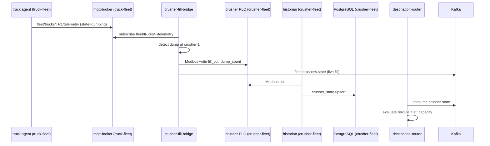
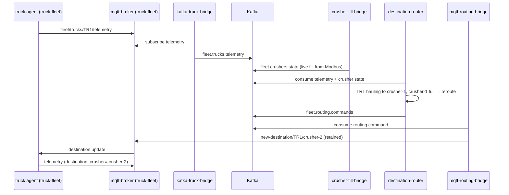

# Fleet integration (`fleet-integration`)

Kafka-based orchestration layer that connects the three independent mining-fleet ecosystems without modifying their internals. Routing intelligence lives here — not in `truck-fleet`, `crusher-fleet`, or `water-spray-fleet`.

Parent overview: [../README.md](../README.md).

---

## Independence principle

| System | Namespace | What it owns | What it does **not** do |
|--------|-----------|--------------|-------------------------|
| **Truck fleet** | `truck-fleet` | MQTT telemetry, PostgreSQL ingest | Crusher logic, routing decisions |
| **Crusher fleet** | `crusher-fleet` | Modbus PLCs, plant historian | MQTT, truck commands |
| **Water spray fleet** | `water-spray-fleet` | Modbus spray PLCs | Truck/crusher internals |
| **Fleet integration** | `fleet-integration` | Kafka orchestration, MQTT routing bridge | Own operational data stores |

Trucks bootstrap from **`DEFAULT_CRUSHER`** (env per Pod). Runtime rerouting arrives **only** via MQTT `new-destination/{truck_id}/{crusher_name}`, published by **`mqtt-routing-bridge`** in this namespace.

Crushers do **not** talk MQTT. Crusher fill is driven by truck dump events via **`crusher-fill-bridge`**, which writes Modbus registers in `crusher-fleet` and publishes live state to `fleet.crushers.state`.

---

## Architecture

```text
truck-fleet (unchanged)          crusher-fleet (unchanged)        water-spray-fleet (unchanged)
  MQTT telemetry                    Modbus PLCs (external writes)    Modbus → own store
  mqtt-ingest → PostgreSQL          historian → PostgreSQL           → Kafka (future)
       ↓                                   ↑
       └──────────────→  fleet-integration / Kafka (AMQ Streams)  ←──┘
                              ↓
                    kafka-truck-bridge → fleet.trucks.telemetry (for destination-router)
                    crusher-fill-bridge ← MQTT fleet/trucks/+/telemetry (direct)
                         → Modbus writes (crusher-fleet)
                         → fleet.crushers.state
                              ↓
                    destination-router
                    consumes: fleet.trucks.telemetry, fleet.crushers.state
                    produces: fleet.routing.commands, fleet.truck.commands (stop)
                              ↓
                    crusher-capacity-monitor
                    consumes: fleet.trucks.telemetry, fleet.crushers.state
                    publishes: MQTT resume + new-destination when fill < 50%
                              ↓
                    mqtt-routing-bridge
                    consumes fleet.routing.commands, fleet.truck.commands → MQTT
```

**`kafka-truck-bridge`** mirrors MQTT truck telemetry to Kafka for **`destination-router`**. **`crusher-fill-bridge`** subscribes directly to truck MQTT (read-only, cross-namespace) to detect dump events and write crusher Modbus registers. It still publishes live state to `fleet.crushers.state` for routing. The deprecated **`crusher-state-producer`** mock is replaced by live state from `crusher-fill-bridge`.

---

## Sequence diagram (truck dump → crusher fill)



## Sequence diagram (destination reroute)



---

## Kafka topic contracts

### `fleet.trucks.telemetry`

Produced by: `kafka-truck-bridge` (Phase 1 demo) or Debezium CDC / ETL from truck PostgreSQL (Phase 2).

Partition key: `truck_id`

```json
{
  "truck_id": "TR1",
  "state": "hauling",
  "destination_crusher": "crusher-1",
  "load_pct": 100.0,
  "position_x": -800.0,
  "position_y": 400.0,
  "speed_kmh": 35.0,
  "timestamp": "2026-06-01T12:00:00+00:00",
  "source": "mqtt-bridge"
}
```

### `fleet.crushers.state`

Produced by: `crusher-fill-bridge` (writes Modbus after truck dumps, publishes live state).

Partition key: `crusher_name`

```json
{
  "crusher_name": "crusher-1",
  "status": "full",
  "fill_pct": 95.0,
  "at_capacity": true,
  "max_queue": 3,
  "current_queue": 4,
  "updated_at": "2026-06-01T12:00:00+00:00",
  "source": "crusher-fill-bridge"
}
```

### `fleet.routing.commands`

Produced by: `destination-router`. Consumed by: `mqtt-routing-bridge`.

Partition key: `truck_id`

```json
{
  "truck_id": "TR1",
  "crusher_name": "crusher-2",
  "reason": "crusher-1_at_capacity",
  "decided_at": "2026-06-01T12:00:05+00:00",
  "source": "destination-router"
}
```

MQTT bridge publishes to **`new-destination/{truck_id}/{crusher_name}`** with retained QoS 1 (same contract trucks already use).

### `fleet.truck.commands`

Produced by: `destination-router`, `fleet-live-map` (manual). Consumed by: `mqtt-routing-bridge`.

Partition key: `truck_id`

```json
{
  "truck_id": "TR1",
  "action": "stop",
  "reason": "both_crushers_at_capacity",
  "decided_at": "2026-06-01T12:00:05+00:00",
  "source": "destination-router"
}
```

MQTT bridge publishes to **`fleet/trucks/{truck_id}/command`** with JSON `{"action": "stop"|"resume", ...}` (QoS 1, not retained).

---

## Routing rules

When a truck is in **`hauling`** state and its `destination_crusher` is **at capacity** (from `fleet.crushers.state`), `destination-router` emits a command to the first available alternate crusher.

When **both** crushers are at capacity, all trucks in **`hauling`** receive **stop** commands on `fleet.truck.commands` (via `destination-router` → `mqtt-routing-bridge`). When crusher fill drops **below 50%** (configurable), **`crusher-capacity-monitor`** resumes eligible stopped trucks directly on MQTT with reason `crusher_below_50pct` and assigns the best available crusher.

Manual haul holds from the live map (`haul_hold=true`, reason `manual_*`) are **not** overridden by the capacity monitor.

Crusher PLCs drain fill at a constant rate (`DRAIN_RATE_PCT` per tick) when not receiving dumps, simulating ore processing. The historian continues polling Modbus → PostgreSQL.

Crusher fill increases only when trucks dump — watch fill rise in PostgreSQL as trucks cycle:

```bash
oc exec -n crusher-fleet deploy/postgresql -- \
  env PGPASSWORD=crusherfleet-demo psql -U crusherfleet -d crusherfleet \
  -c "SELECT crusher_id, fill_pct, dump_count, updated_at FROM crusher_state;"
```

---

## Repository layout

| Path | Contents |
|------|----------|
| [`poc/fleet-integration/`](../../poc/fleet-integration/) | Python services + Dockerfiles |
| [`openshift/fleet-integration/`](../../openshift/fleet-integration/) | Namespace, ConfigMaps, BuildConfigs, Deployments, Kafka topics |

### Components

| Service | Role |
|---------|------|
| **`kafka-truck-bridge`** | Subscribes `fleet/trucks/+/telemetry` on truck-fleet MQTT → produces `fleet.trucks.telemetry` (for destination-router) |
| **`crusher-fill-bridge`** | Subscribes truck MQTT telemetry (read-only) → writes crusher Modbus on dump events → publishes `fleet.crushers.state` |
| **`destination-router`** | Consumes telemetry + crusher state → produces `fleet.routing.commands` and stop on `fleet.truck.commands` |
| **`crusher-capacity-monitor`** | Consumes telemetry + crusher state → MQTT resume + `new-destination` when fill &lt; threshold |
| **`mqtt-routing-bridge`** | Consumes routing + truck commands → publishes `new-destination/{truck}/{crusher}` and `fleet/trucks/{truck}/command` to truck-fleet MQTT |
| **`crusher-state-producer`** | Deprecated mock (replicas=0); replaced by `crusher-fill-bridge` |

---

## Prerequisites

1. **`truck-fleet`** running (MQTT broker, truck agents, mqtt-ingest).
2. **Kafka / AMQ Streams** — dedicated Strimzi cluster `mining-fleet-cluster` in namespace `mining-fleet-kafka` (see `openshift/mining-fleet-kafka/`).
3. Optional but recommended: deploy `openshift/mining-fleet-kafka/06-kafka-console.yaml` to inspect topics, consumer groups, and message flow through the dedicated cluster.

### Install Kafka topics (when cluster has Strimzi)

```bash
oc apply -f openshift/fleet-integration/03-kafka-topics.yaml
```

If AMQ Streams is not installed, commit and apply manifests without topics; services will retry until Kafka is available.

---

## Deployment

```bash
oc apply -f openshift/fleet-integration/01-namespace.yaml
oc apply -f openshift/fleet-integration/02-configmaps.yaml
oc apply -f openshift/fleet-integration/03-kafka-topics.yaml   # if Kafka present
oc apply -f openshift/fleet-integration/04-buildconfigs.yaml
oc start-build kafka-truck-bridge destination-router mqtt-routing-bridge crusher-fill-bridge crusher-capacity-monitor \
  -n fleet-integration --wait
oc apply -f openshift/fleet-integration/05-kafka-truck-bridge.yaml
oc apply -f openshift/fleet-integration/09-crusher-fill-bridge.yaml
oc apply -f openshift/fleet-integration/07-destination-router.yaml
oc apply -f openshift/fleet-integration/08-mqtt-routing-bridge.yaml
oc apply -f openshift/fleet-integration/10-crusher-capacity-monitor.yaml
```

BuildConfigs pull from `https://github.com/SimonDelord/alleo-work.git` on `main`. Push this repo before building.

### Undeploy old crusher-assignment (truck-fleet)

```bash
oc delete deployment crusher-assignment -n truck-fleet --ignore-not-found
oc delete sa,role,rolebinding -l app=crusher-assignment -n truck-fleet --ignore-not-found
```

---

## Verify rerouting

```bash
oc get pods -n fleet-integration
oc logs -n fleet-integration deploy/destination-router --tail=20
oc logs -n fleet-integration deploy/mqtt-routing-bridge --tail=20
oc logs -n truck-fleet deploy/truck-tr1 --tail=10
# Expect: Destination updated: crusher-1 → crusher-2 (source=fleet-integration)
```

---

## Environment variables

Shared ConfigMap **`fleet-integration-env`**:

| Variable | Default | Used by |
|----------|---------|---------|
| `KAFKA_BOOTSTRAP_SERVERS` | `mining-fleet-cluster-kafka-bootstrap.mining-fleet-kafka.svc:9092` | kafka-truck-bridge, crusher-fill-bridge (produce), destination-router, mqtt-routing-bridge |
| `KAFKA_TOPIC_TRUCK_TELEMETRY` | `fleet.trucks.telemetry` | kafka-truck-bridge, destination-router |
| `KAFKA_TOPIC_CRUSHER_STATE` | `fleet.crushers.state` | crusher-fill-bridge, destination-router |
| `KAFKA_TOPIC_ROUTING_COMMANDS` | `fleet.routing.commands` | destination-router, mqtt-routing-bridge, fleet-live-map |
| `KAFKA_TOPIC_TRUCK_COMMANDS` | `fleet.truck.commands` | destination-router, mqtt-routing-bridge, fleet-live-map |
| `ROUTING_ACTIVE_STATES` | `hauling` | destination-router |
| `MQTT_TRUCK_COMMAND_TOPIC_PREFIX` | `fleet/trucks` | mqtt-routing-bridge |
| `MQTT_BROKER` | `mqtt-broker.truck-fleet.svc:1883` | crusher-fill-bridge |
| `MQTT_HOST` | `mqtt-broker.truck-fleet.svc` | kafka-truck-bridge, mqtt-routing-bridge |
| `MQTT_PORT` | `1883` | kafka-truck-bridge, crusher-fill-bridge, mqtt-routing-bridge |
| `MQTT_TOPIC_SUBSCRIBE` | `fleet/trucks/+/telemetry` | kafka-truck-bridge, crusher-fill-bridge |
| `MQTT_NEW_DESTINATION_TOPIC` | `new-destination` | mqtt-routing-bridge |
| `VALID_CRUSHERS` | `crusher-1,crusher-2` | destination-router |
| `FALLBACK_CRUSHER` | `crusher-2` | destination-router |
| `CAPACITY_FILL_PCT` | `90` | crusher-fill-bridge |
| `FILL_PER_LOAD_PCT` | `0.12` | crusher-fill-bridge |
| `CRUSHER_MODBUS_TARGETS` | ConfigMap `crusher-modbus-targets` | crusher-fill-bridge |
| `CRUSHER_RESUME_THRESHOLD_PCT` | `50` | crusher-capacity-monitor |
| `CRUSHER_RESUME_REASON` | `crusher_below_50pct` | crusher-capacity-monitor |

---

## Phase 2 evolution

| Phase 1 (demo) | Phase 2 (production-shaped) |
|----------------|-------------------------------|
| `kafka-truck-bridge` mirrors MQTT | Debezium CDC from truck PostgreSQL |
| `crusher-fill-bridge` truck-driven Modbus writes | Same pattern + historian CDC for audit |
| Simple capacity reroute rule | Queue depth, ETA, maintenance windows |
| Single `destination-router` | Optional stream processing / Flink |

Water-spray rules will consume the same Kafka bus (`fleet.trucks.events`, `fleet.crushers.events`) from a separate controller in `water-spray-fleet` or here — still without touching truck or crusher internals.

---

## Also see

- [truck-fleet/README.md](../truck-fleet/README.md) — truck MQTT/Postgres (unchanged agents)
- [crusher-fleet/README.md](../crusher-fleet/README.md) — future crusher Kafka producer
- [`openshift/fleet-integration/README.md`](../../openshift/fleet-integration/README.md) — manifest index
