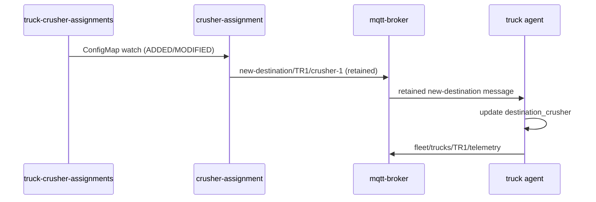

# Truck fleet (`truck-fleet`)

Mobile haul fleet demo on OpenShift: three simulated trucks publish operational telemetry over **MQTT**; **mqtt-ingest** writes normalized rows into **PostgreSQL** for dashboards and assignment logic.

Parent overview: [../README.md](../README.md).

---

## Architecture

```text
┌──────────────┐   fleet/trucks/TR*/telemetry      ┌─────────────┐
│  truck-tr1   │ ─────────────────────────────────►│             │
│  truck-tr2   │                                   │ mqtt-broker │
│  truck-tr3   │ ◄── new-destination/{id}/{crusher}│  (Mosquitto)│
└──────▲───────┘                                   │   :1883     │
       │                                            └──────┬──────┘
       │ subscribe                                       │
┌──────┴───────────┐   publish (retained)               │ fleet/trucks/+/telemetry
│ crusher-assignment│◄── watch ── truck-crusher-         ▼
│  (Deployment)    │              assignments    ┌─────────────┐
└──────────────────┘      (ConfigMap)            │ mqtt-ingest │
                                                 └──────┬──────┘
                                                        │ INSERT + UPSERT
                                                        ▼
                                                 ┌─────────────┐
                                                 │ PostgreSQL  │
                                                 └─────────────┘
```

Everything runs in namespace **`truck-fleet`**. External consumers should read **PostgreSQL** (or a future HTTP/API gateway), not raw MQTT from outside the namespace.

---

## Crusher assignment (static bootstrap → dynamic runtime)

Each truck **starts with a specific crusher in mind** (`DEFAULT_CRUSHER` env) and **listens on MQTT** for destination updates. Assignment is **MQTT-driven** so the truck-fleet and crusher-fleet namespaces stay decoupled.

### Bootstrap (Phase 1)

1. Each truck Pod sets **`DEFAULT_CRUSHER`** (env) as the initial destination until a retained `new-destination` message arrives.
2. ConfigMap **`truck-crusher-assignments`** holds the initial mapping:

```yaml
assignments:
  TR1: crusher-1
  TR2: crusher-2
  TR3: crusher-1
```

3. **`crusher-assignment`** reads that ConfigMap on startup, watches for edits, and publishes to **`new-destination/{truck_id}/{crusher_name}`** (retained messages).

### Runtime (Phase 2 ready)

The same **`new-destination/{truck_id}/{crusher_name}`** topics can be published by a future controller in **`crusher-fleet`** when crushers report capacity, queue depth, or availability — no truck-agent changes required.



### Change assignments at runtime

Edit the ConfigMap; **`crusher-assignment`** republishes within seconds:

```bash
oc edit configmap truck-crusher-assignments -n truck-fleet
# Change e.g. TR1: crusher-2, save and exit
```

Verify in truck logs or PostgreSQL:

```bash
oc logs -n truck-fleet deploy/truck-tr1 --tail=5
# Expect: Destination updated: crusher-1 → crusher-2

oc port-forward -n truck-fleet svc/postgresql 5432:5432 &
PGPASSWORD=truckfleet-demo psql -h localhost -U truckfleet -d truckfleet -c \
  "SELECT truck_id, destination_crusher, recorded_at FROM truck_state ORDER BY truck_id;"
```

Trucks mid-haul redirect toward the newly assigned crusher on the next simulation tick.

Manual test publish:

```bash
mosquitto_pub -h mqtt-broker.truck-fleet.svc -t 'new-destination/TR1/crusher-2' \
  -m '{"truck_id":"TR1","crusher_name":"crusher-2","source":"manual"}' -r
```

---

## Truck simulation

Each truck agent (`poc/truck-fleet/truck_agent.py`) cycles through four states on a fixed tick interval (default **2 s**):

| State | Behaviour |
|-------|-----------|
| **loading** | At the loading area; `load_pct` increases to 100 % |
| **hauling** | Travels toward assigned crusher with full load |
| **dumping** | At crusher; `load_pct` decreases to 0 % |
| **returning** | Travels back to loading area empty |

Crusher assignments are **dynamic via MQTT** (see [Crusher assignment](#crusher-assignment-static-bootstrap--dynamic-runtime)). Initial bootstrap mapping:

| Truck | Bootstrap (`DEFAULT_CRUSHER`) |
|-------|-------------------------------|
| TR1 | crusher-1 |
| TR2 | crusher-2 |
| TR3 | crusher-1 |

Crushers are coordinate targets in telemetry only (`crusher-1`, `crusher-2`); crusher Pods are a separate ecosystem (`crusher-fleet`).

---

## MQTT topic design

| Topic | Publisher | Subscriber | Payload |
|-------|-----------|------------|---------|
| `fleet/trucks/{truck_id}/telemetry` | Truck agent | mqtt-ingest | JSON telemetry (see below) |
| `new-destination/{truck_id}/{crusher_name}` | crusher-assignment (future: crusher-fleet) | Per-truck agent (`new-destination/{TRUCK_ID}/+`) | JSON metadata (retained, QoS 1); crusher encoded in topic path |

Trucks subscribe to **`new-destination/{TRUCK_ID}/+`**. The crusher name is taken from the topic path; the JSON payload is optional metadata.

**New destination** (`new-destination/TR1/crusher-2`):

```json
{
  "truck_id": "TR1",
  "crusher_name": "crusher-2",
  "assigned_at": "2026-06-01T12:00:00+00:00",
  "source": "crusher-fleet"
}
```

Example telemetry payload:

```json
{
  "truck_id": "TR1",
  "state": "hauling",
  "lat": 0.003604,
  "lon": -0.010811,
  "position_x": -800.0,
  "position_y": 400.0,
  "progress": 0.42,
  "speed_kmh": 35.0,
  "load_pct": 100.0,
  "destination_crusher": "crusher-1",
  "assignment_source": "crusher-fleet",
  "timestamp": "2026-06-01T12:00:00+00:00"
}
```

**Ingest subscription:** `fleet/trucks/+/telemetry` (MQTT single-level `+` wildcard).

Demo broker allows **anonymous** publish/subscribe (no TLS/auth). Harden for production.

---

## PostgreSQL schema

Created automatically by **mqtt-ingest** on startup.

### `truck_telemetry` (history)

| Column | Type | Notes |
|--------|------|-------|
| `id` | BIGSERIAL | Primary key |
| `truck_id` | VARCHAR(32) | e.g. TR1 |
| `state` | VARCHAR(32) | loading / hauling / dumping / returning |
| `load_pct` | REAL | 0–100 |
| `speed_kmh` | REAL | 0 when stationary |
| `position_x`, `position_y` | REAL | Demo mine coordinates (meters) |
| `lat`, `lon` | DOUBLE PRECISION | Derived from x/y |
| `destination_crusher` | VARCHAR(32) | crusher-1 / crusher-2 |
| `recorded_at` | TIMESTAMPTZ | From payload `timestamp` |

### `truck_state` (latest snapshot)

Same fields as telemetry (except `id`), keyed by `truck_id`. Updated via **UPSERT** on each message.

---

## Repository layout

| Path | Contents |
|------|----------|
| [`poc/truck-fleet/`](../../poc/truck-fleet/) | `truck_agent.py`, `crusher_assignment.py`, `mqtt_ingest.py`, Dockerfiles, `requirements.txt` |
| [`openshift/truck-fleet/`](../../openshift/truck-fleet/) | Numbered manifests: namespace, ConfigMaps/Secrets, broker, Postgres, BuildConfigs, Deployments |

---

## Deployment on OpenShift

### Prerequisites

- `oc` logged in (`oc whoami`)
- Cluster can pull `eclipse-mosquitto:2.0.18` and `postgres:16-alpine`
- OpenShift internal registry available for built images

### Apply

```bash
oc apply -f openshift/truck-fleet/01-namespace.yaml
oc apply -f openshift/truck-fleet/02-configmaps-secrets.yaml
oc apply -f openshift/truck-fleet/03-mqtt-broker.yaml
oc apply -f openshift/truck-fleet/04-postgresql.yaml
oc apply -f openshift/truck-fleet/05-buildconfigs.yaml
oc start-build truck-agent mqtt-ingest crusher-assignment -n truck-fleet --wait
oc apply -f openshift/truck-fleet/06-truck-agents.yaml
oc apply -f openshift/truck-fleet/07-mqtt-ingest.yaml
oc apply -f openshift/truck-fleet/08-crusher-assignment.yaml
```

BuildConfigs clone **`poc/truck-fleet`** from GitHub (`SimonDelord/alleo-work`, branch `main`). **Push this repo before building**, or point `git.uri` in `05-buildconfigs.yaml` at your fork.

### Verify pods

```bash
oc get pods -n truck-fleet
# Expect: mqtt-broker, postgresql, mqtt-ingest, crusher-assignment, truck-tr1, truck-tr2, truck-tr3 — all Running
```

### Verify telemetry flow

```bash
oc logs -n truck-fleet deploy/truck-tr1 --tail=5
oc logs -n truck-fleet deploy/mqtt-ingest --tail=10
```

### Sample SQL

Port-forward Postgres:

```bash
oc port-forward -n truck-fleet svc/postgresql 5432:5432
```

```sql
-- Latest state per truck
SELECT truck_id, state, load_pct, speed_kmh,
       position_x, position_y, destination_crusher, recorded_at
FROM truck_state
ORDER BY truck_id;

-- Recent history
SELECT truck_id, state, load_pct, recorded_at
FROM truck_telemetry
ORDER BY recorded_at DESC
LIMIT 30;
```

Credentials (demo): user `truckfleet`, password `truckfleet-demo`, database `truckfleet` — from Secret `postgresql-credentials`. Replace in production.

---

## Environment variables

Shared ConfigMap **`truck-fleet-env`**:

| Variable | Default | Used by |
|----------|---------|---------|
| `MQTT_HOST` | `mqtt-broker` | trucks, ingest |
| `MQTT_PORT` | `1883` | trucks, ingest |
| `MQTT_TOPIC_PREFIX` | `fleet/trucks` | trucks |
| `MQTT_TOPIC_SUBSCRIBE` | `fleet/trucks/+/telemetry` | ingest |
| `MQTT_NEW_DESTINATION_TOPIC` | `new-destination` | trucks, crusher-assignment |
| `ASSIGNMENTS_CONFIGMAP` | `truck-crusher-assignments` | crusher-assignment |
| `ASSIGNMENT_SOURCE` | `crusher-fleet` | crusher-assignment |
| `VALID_CRUSHERS` | `crusher-1,crusher-2` | trucks |
| `TICK_SEC` | `2.0` | trucks |
| `PGHOST` | `postgresql` | ingest |
| `PGDATABASE` / `PGUSER` | `truckfleet` | ingest |

Per-truck Deployment env: **`TRUCK_ID`**, **`DEFAULT_CRUSHER`** (bootstrap destination until first `new-destination` MQTT message).

Secret **`postgresql-credentials`**: `PGPASSWORD`, `POSTGRES_*`.

---

## Phase 2 (Kafka integration)

When the site bus is live, mqtt-ingest or a CDC connector can publish **`fleet.trucks.telemetry`** / **`fleet.trucks.events`** for crusher and spray ecosystems. See [../README.md](../README.md#phase-2--kafka-integration-overview).

---

## Also see

- [`poc/truck-fleet/README.md`](../../poc/truck-fleet/README.md) — source files and local run hints
- [`openshift/truck-fleet/README.md`](../../openshift/truck-fleet/README.md) — manifest index and verify commands
